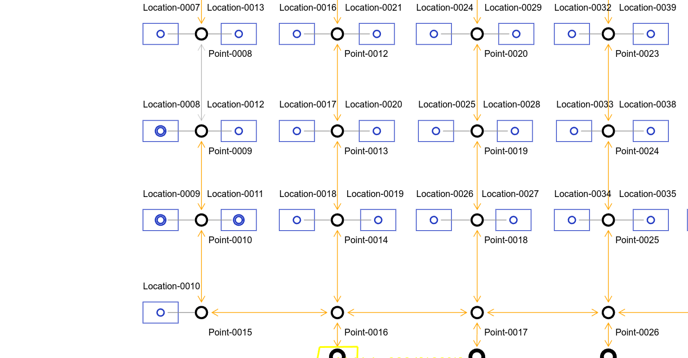
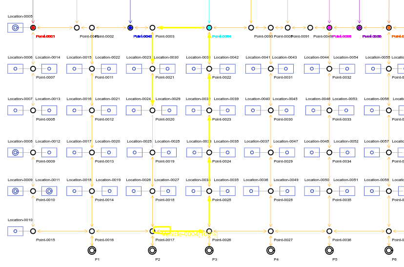

----
### 编译

依赖：
[Eclipse Paho MQTT C++ Client Library](https://github.com/eclipse/paho.mqtt.cpp)

ubuntu 安装依赖
> sudo apt install libpaho-mqttpp-dev

> paho-mqttpp依赖eclipse-paho-mqtt-c和openssl,一般会自动安装


添加test选项编译，编译车辆端模拟的代码
注意修改test/kernel/driver/rabbit3_test.cc中的line537，改为自己的MQTT代理服务器的ip地址
```cpp
agv1.set_mqtt_ops(agv1.serial_number, "192.168.0.39");
```

```bash
mkdir build
cd build
mkdir install
cmake -DTEST=ON -DCMAKE_INSTALL_PREFIX=./install .. 
make install -j4
```


### 配置MQTT代理服务器
我用的 **Eclipse Mosquitto**
安装后配置端口和ip
默认配置文件路径在 **/etc/mosquitto/mosquitto.conf**
添加或修改对应配置
```
listener 1883 0.0.0.0
allow_anonymous true
```
默认的日志路径 **/var/log/mosquitto/mosquitto.log**
用MQTTX测试一下确定连接通畅
### 运行服务端
```
cd ./install/TCS
ls
```
确保当前路径下存在config目录
运行 tcs文件
```
./tcs
```
正常的输出
```
2024-04-30 11:30:24,808 INFO [tcs] read param success
[I 240430 11:30:24.8092 httpsrv.cc:295] listen 0.0.0.0:8080
[I 240430 11:30:25.0094 main.cc:228] service start, press 'Ctrl + C' to exit.
```
此时需要上传模型，否则其他请求都会返回失败


### 使用api工具发送http请求
config中有api接口定义文件
> TCS.openapi.json

发送上传模型请求：
路由 /plantModel
参数 type 设置为xml
body config中的map.xml

注意修改车辆属性中的MQTT代理的ip
```xml
 <vehicle name="Vehicle-0004" length="1000" energyLevelCritical="30" energyLevelGood="90"
        energyLevelFullyRecharged="30" energyLevelSufficientlyRecharged="90" maxVelocity="1000"
        maxReverseVelocity="1000">
        <property name="tcs:preferredAdapterClass"
            value="org.opentcs.virtualvehicle.LoopbackCommunicationAdapterFactory" />
        <property name="vda5050:interfaceName" value="uagv" />
        <property name="vda5050:manufacturer" value="rw" />
        <property name="vda5050:minVisualizationInterval" value="1000" />
        <property name="vda5050:orderQueueSize" value="2" />
        <property name="vda5050:serialNumber" value="tx4" />
        <property name="vda5050:version" value="2.0" />
        <property name="vda5050:ip" value="192.168.0.39" />
        <property name="vda5050:port" value="1883" />
        <vehicleLayout color="#FFFF00" />
    </vehicle>
```

操作成功服务器会输出
```
[I 240430 11:33:47.4365 tcs.cc:627] init orderpool ok
[I 240430 11:33:47.4365 tcs.cc:632] init scheduler ok
[I 240430 11:33:47.4365 tcs.cc:622] init dispatcher ok
[I 240430 11:33:47.4369 tcs.cc:84] init point size 93
[I 240430 11:33:47.4371 tcs.cc:152] init loc_type size 3
[I 240430 11:33:47.4373 tcs.cc:236] init location size 91
[I 240430 11:33:47.4486 tcs.cc:336] init path size 98
[I 240430 11:33:47.4490 tcs.cc:500] init vehicle size 4
[I 240430 11:33:47.4490 tcs.cc:504] init resource ok
[I 240430 11:33:47.4495 timer.hpp:25] generate map use time: 0(s) 0(ms) 487(us)
[I 240430 11:33:47.4495 tcs.cc:640] init planner ok
[I 240430 11:33:47.4495 tcs.cc:523] run all ...
[I 240430 11:33:47.4508 dispatch.cc:279] Dispatcher run....
[I 240430 11:33:47.4608 schedule.cc:10] Scheduler run....
[I 240430 11:33:47.4609 tcs.cc:525] run all ok
[I 240430 11:33:47.5507 master.cc:47] mqtt_serial_number:tx2 master ONLINE
[I 240430 11:33:47.5508 master.cc:47] mqtt_serial_number:tx1 master ONLINE
[I 240430 11:33:47.5508 master.cc:47] mqtt_serial_number:tx3 master ONLINE
[I 240430 11:33:47.5508 master.cc:47] mqtt_serial_number:tx4 master ONLINE
[W 240430 11:33:47.5911 vehicle.cc:666] Vehicle-0002 tx2 CONNECTIONBROKEN
[W 240430 11:33:47.5912 vehicle.cc:666] Vehicle-0001 tx1 CONNECTIONBROKEN
[W 240430 11:33:47.5950 vehicle.cc:666] Vehicle-0003 tx3 CONNECTIONBROKEN
[W 240430 11:33:47.5951 vehicle.cc:666] Vehicle-0004 tx4 CONNECTIONBROKEN
```
表示解析模型成功，服务资源初始化成功，服务器连接MQTT代理成功，由于接收到车辆上次的遗嘱消息或者状态未更新,
车辆状态为broken,然后等待车辆连接

可以多次重新上传模型，资源会清理然后重新创建
>**不要在车辆执行订单过程中重新上传**


### 使用网页查看模型
用浏览器打开config中的view.html
确认ip和端口后，确定
如果操作成功会显示地图
>在地图上滚轮可以放大缩小地图，没有其他可以用的操作

粗圆环表示停靠点；双线圆环表示充电点；被禁用的道路和操作点不会显示
带颜色的路径和点表示不同的block区域；正方形方框表示周边操作点


### 打开车辆客户端

```
./sim_agv_test
```
代码里创建了四个模拟车辆，默认注释了3个
成功连接到代理后显示
```
2024-04-30 13:36:23,770 INFO [default] tx1  ONLINE
```
服务端显示
```
[I 240430 13:36:23.7704 vehicle.cc:657] Vehicle-0001 tx1 ONLINE
```
表示已经和车辆在正常通信了
网页可以看到车辆id和电量

如果电量不足会先自动去最近的充电点充电，充电结束后自动去最近的停靠点

车辆端执行任务会打印一些输出
```
2024-04-30 14:45:36,170 INFO [default] 接收到的mqtt消息内容....
2024-04-30 14:45:36,170 INFO [default] move from Point-0031 to Point-0030
2024-04-30 14:45:36,170 INFO [default] Vx -0.000218557 Vy -5000
2024-04-30 14:45:37,573 INFO [default] move from Point-0030 to Point-0029
2024-04-30 14:45:37,573 INFO [default] Vx -0.000218557 Vy -5000
```

车辆端退出，服务端会打印
```
[W 240430 15:25:08.6232 vehicle.cc:666] Vehicle-0001 tx1 CONNECTIONBROKEN
```
如果该车辆当前有任务，该任务随之失败


### 新建运输订单
使用api工具发送请求：
路由 /transportOrders/{name}
参数 name 订单编号，唯一
body 订单具体内容

示例： 发送pick订单


车辆按规划路径移动，完后任务后如果空闲会去充电或着停靠点
去停靠点或者充电的路径上（根据电量情况）新建订单会立即取消当前任务去执行新订单
当前默认服务端会一次发送两个path(3个node)指令到车辆客户端，然后根据执行结果继续发送后续节点路径


### VDA动作
由机器人执行的动作，服务器发送指令，机器人执行，并反馈结果


当前
```
      NOP,     // 啥也不干
      pick,    // 去某location load
      drop,  // 去某location unload
      MOVE,    // 去某point,并停在那里，未完成
      Charge,  // 充电
      CLOSE, //关门
      OPEN, //开门
```
其中close和open是路径属性中的定义的动作自动下发，其他的可以由运输订单来下发
如果路径点上定义了相应的动作，根据触发时机会发送动作到车辆
服务端会显示动作状态
例如：Point-0027 --- point-0036路径定义了两个门的动作，当前是模拟只打印动作名称表示执行完成


```
[I 240430 13:51:41.9991 vehicle.cc:791] Vehicle-0001 01 Door
[I 240430 13:51:41.9992 vehicle.cc:791] Vehicle-0001 02 Door
```
等待动作完成（如果需要等待结果）
```
[I 240430 13:51:55.9562 vehicle.cc:1058] Vehicle-0001 action [pick] ok
```
所有需要等待结果的动作都完成后继续执行后续操作
```
[I 240430 13:51:55.9563 vehicle.cc:1075] Vehicle-0001 all actions ok
```

### 周边操作
电梯等其他外设，由服务器直接执行的动作，具体操作目前留空，用打印来模拟
如果路径点上定义了相应的动作，根据触发时机会去调用
例如 point-0090 --- point-0004上的定义了电梯操作
操作点要存在且该操作要在allowedPeripheralOperation中


刚刚执行完订单后，车辆当前在P12停靠，下一个去location-75的订单，车辆会经过此路径
在移动前up
```
[I 240430 14:36:04.6749 vehicle.cc:778] do Location-0001[up]
```
在移动后down
```
[I 240430 14:36:06.7941 vehicle.cc:895] do Location-0001[down]
```

### 禁用道路或操作点

使用api工具发送请求
例如请求禁用Point-0022 --- Point-0023
请求成功后该道路变为不可用，同时网页会取消显示（可能需要鼠标滚轮滚一下，地图是静态的，分辨率变化后重新绘制）


机器人此时在P2点，发送一个NOP指令
规划的路径会避开该path


禁用操作点后，如果订单的终点是操作点，订单会直接失败

发送取消禁用请求后道路变为可用，网页会重新显示

#### 其他api操作
使用API工具自行测试
TODO 